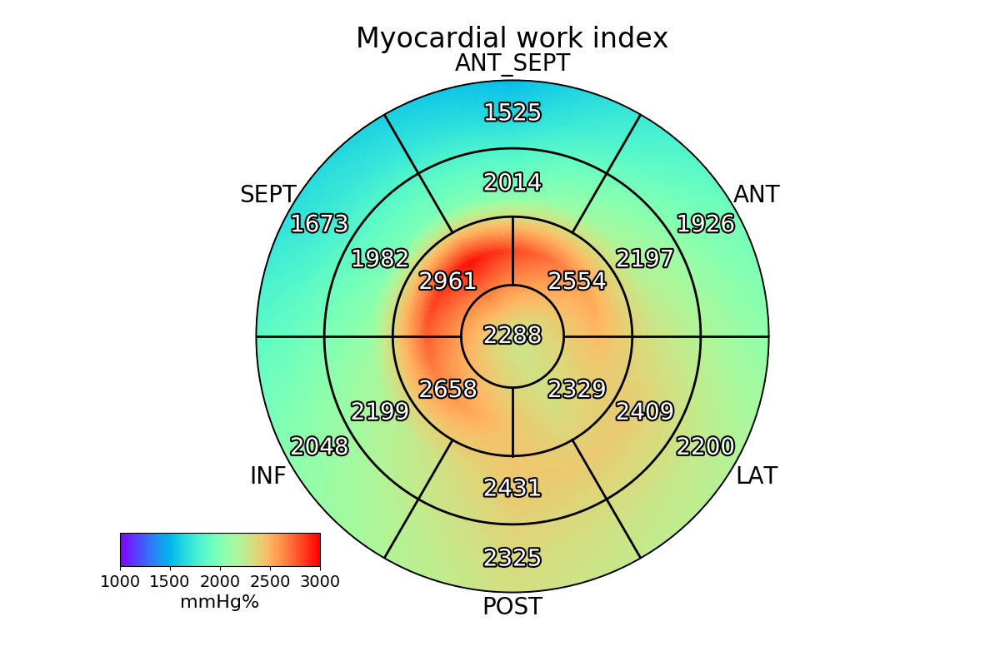
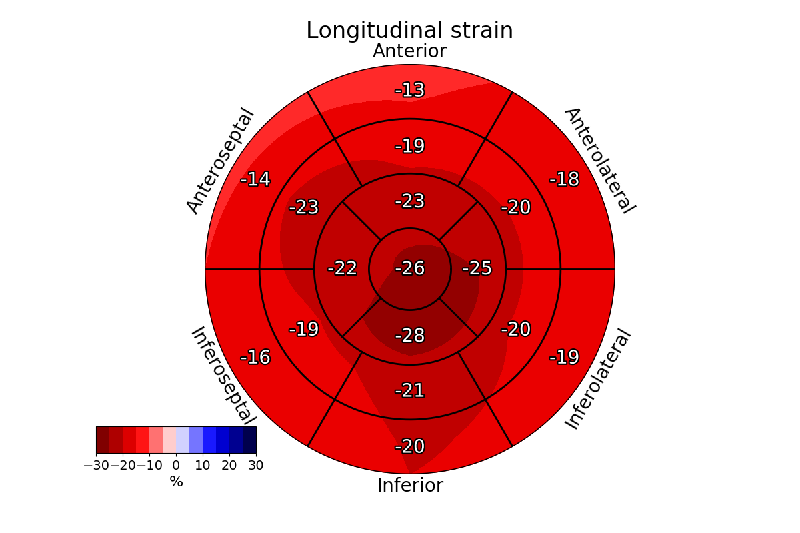

# Smooth 17 and 18 segment AHA bullseye plots


# Motivation


---
# Screenshots
## 17 AHA plot of Myocardial Work


## Myocardial Work - EchoPAC version


## 17 AHA plot of Segmental Strain


## Segmental Strain - EchoPAC version


---
# How2use

### class

**Call**
```python
```

---
**Input**

---
**Output** 

---
**Methods**


# Credits
Abstract

---
# License
